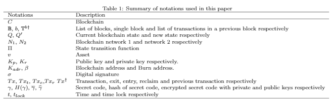

# The Burn-to-Claim cross-Blockchain asset transfer protocols

Burn-to-claim is an open protocol developed by Griffith researchers that aims to address cross-blockchain asset transfer between networks of blockchain in a decentralised manner. The design is to transfer assets from one blockchain network to another in a way that it is being burned (destroyed) from one blockchain network and re-created on the other blockchain network. This protocol has two components: an exit transaction to generate a self-verifiable transfer-proof that the asset is burned on the source network and an entry transaction to verify the validity of transfer-proof and to re-create the asset in the destination network.

## exitTransaction()

The exit-transaction is in the source chain and initiated by the sender. This execution verify the transaction then generates a conditional time-locked and publicly verifiable transfer-proof. We define this transfer-proof to be a committed cross-chain transaction. The conditional timelock means that the transaction output is time-locked in the source network while the transaction is in transit.

- Check the transaction-validity - checks the authenticity of the asset and the owner's ability to spend.
- Generate the transfer-proof - a proof that the asset exists and transfered burned to a burn address 
- TimeLock transaction output is locked while the asset is in transit.
- The screat key

## entryTrasnaction()

The entry-transaction is in the destination chain and initiated by the recipient. Upon presenting the transfer-proof, the destination network nodes verify the validity and correctness of the transfer-proof and execute the exchange. We assume that the recipient’s network nodes can validate the transfer-proof through an intermediary middleware mechanism.

### Overview of the Included Smart Contracts in this project

<li><code>SourceChain.sol</code> is the main contract of in the source chain.</li>
<li><code>DestinationChain.sol</code> is the main contract of in the destination chain.</li>
<li><code>ERC20.sol</code> is an interface of the ERC20 standard for Ethereum tokens.</li>


### Token Contract.sol
This is typical ERC20 token contract. 
The token contract will transfer ERC20 token to the Source chain contract during the deployment.
we will be using the transfer functions from token contract to transfer token berween accounts.

### SourceChain.sol

### DestinationChain.sol

## A high level overview of the Burn-to-Claim protocol workflow


## Notations used


# Installation

# Prerequisites
You need to install the following tools/packages:

* [Node](https://nodejs.org/en/)
* [Ganache](https://www.trufflesuite.com/ganache) 
* [Tuffle](https://www.trufflesuite.com) 

# Deployment
1. Clone the repository: `git clone ---urls---`
2. Install all dependencies: `npm install`
3. Start Ganache: `Ganache-cli`
3. Deploy the contracts: `truffle migrate`
4. Run the tests: `truffle test`

# Testing
Test 1 - `Token.sol`, `SourceChain.sol` and `DestinationChain.sol` Contract deployed
Test 2 - Contract balance - Source chian has the balance
## Run the tests
* Install truffle
* Install ganache [https://truffleframework.com/ganache](https://truffleframework.com/ganache)
* Launch and set the network ID to `8545`
````
$ truffle install
$ truffle test

PS C:\_ethereum\burn-to-claim> truffle test
Using network 'development'.

Compiling your contracts...
===========================
> Compiling .\contracts\DestinationChain.sol
> Compiling .\contracts\Migrations.sol
> Compiling .\contracts\SourceChain.sol
> Compiling .\contracts\Token.sol
> Artifacts written to C:\Users\s5039917\AppData\Local\Temp\test-2020530-24088-ouwbsg.mzyq9
> Compiled successfully using:
   - solc: 0.5.16+commit.9c3226ce.Emscripten.clang

  Contract: Test  - contract deployment test
    smart conract deployment
0x8E11501e08475A5C4d45F87535452fCe92ac7565
      √ Source Chain smart contract is deployed
0xF9F95f5542Ec34643c1707646696a610cDc7b2FB
      √ Destination Chain smart contract is deployed
0xdA278B30A9AfAbDe750d4C996635080c791d08f0
      √ Token contract is deployed
    Check the balance
1000000000000000000000000
      √ The Source chain contract has tokens (78ms)

  Contract: Test- Buy and sell tokens
    Buy the Tokens
      √ User bought a token from the contract (65ms)
    Burn the Tokens
1000000000000000000
      √ The user has transferd the token to a burn address (124ms)
      √ exitTransaction() should fail when no token transfer approved (462ms)
      √ exitTransaction() should fail when token amount is 0 (322ms)
      √ exitTransaction() should fail when tokens approved for some random account (610ms)
      √ exitTransaction() should fail when the timelock is in the past (559ms)


  10 passing (5s)
````
# To-do list on this project

## time lock

We need a timelock for Ether ETH tokens

It requires some features that should be implemented to the contract
- Should be able to lock tokens, defined by the senter and period of time.
- Locked tokens should be able to be transferred by the senter during the lock time period.
